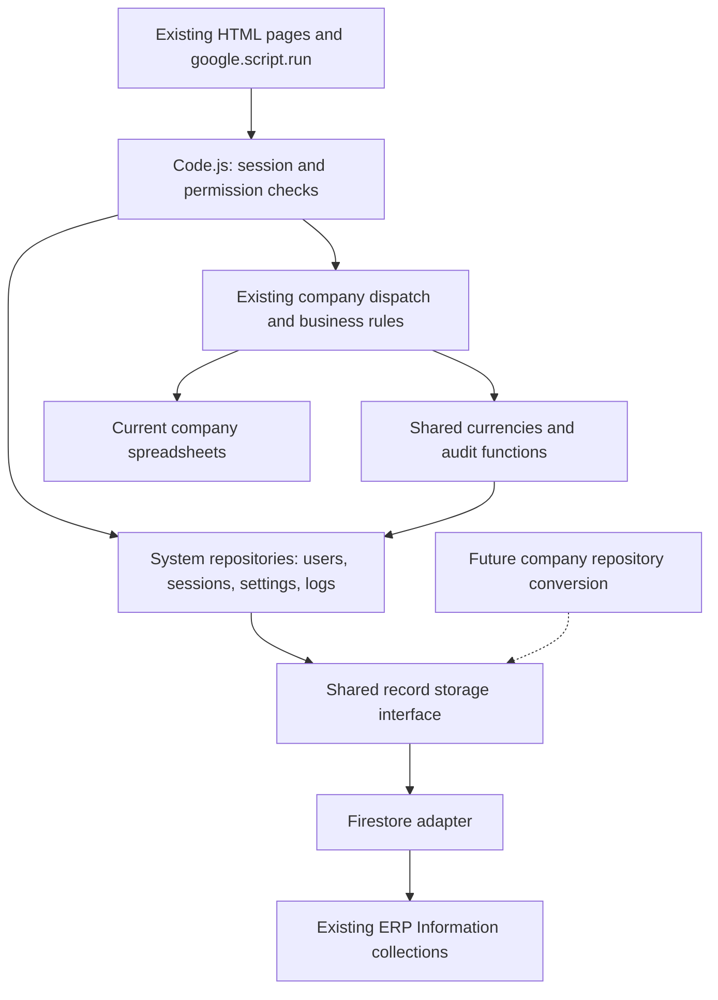

# ERP Information: Firestore read/write implementation plan

Prepared 11 September 2026 against the current working files in `D:\Work\Script`.

## 1. Objective and scope

Change the application so that all tables belonging to the **ERP Information spreadsheet** are read and written in the **existing Firestore database**. Keep the other companies on their current spreadsheets. Introduce a shared storage interface that can support switching those companies later without another rewrite of authentication, routing, or the UI.

This is an application integration plan. The ERP Information data has already been copied. There is no data import, collection relocation, document rekeying, or company data transfer in this work.

Use the existing Firestore collection names, document IDs, fields, and values. New records should follow an explicit application identity policy without changing existing records' identities. Add application metadata only where required for reliable new operations; do not make restructuring the existing database a prerequisite.

**First completed release:** ERP Information uses Firestore for operational reads, writes, and background processing; Top Light, Top Chemical, Valley Foods, and Assessment Center still use Sheets for their business data.

## 2. What the current code establishes

| Current implementation | Consequence for this change |
| --- | --- |
| `00_Config.js` resolves `CONFIG.AUTH_SPREADSHEET_ID`, including a staging override. | Add an independent system storage configuration. A Firestore project ID must never be passed to `SpreadsheetApp.openById()` or treated as a spreadsheet ID. |
| `02_DataAccess.js` implements record reads, sheet handles, headers, row writes, numeric ID allocation, caches, audit stamps, and the history queue. | Replacing `getAllRecords_()` alone is insufficient: callers also manipulate Sheet and Range objects directly. |
| `03_Security.js` directly reads users, companies, permissions, sessions, devices, branding, and the B2 system flag. | These workflows need record-based repository calls. |
| `05_Admin.js` directly edits rows for company/user management, permissions, pages, currencies, invoices, and saved views. | Convert every system-table write, including deletes and print reads. |
| `Code.js` resolves a company's spreadsheet before dispatch, and writes system/client/performance logs. | Preserve company spreadsheet dispatch now; route shared system logging and controls to Firestore. |
| Company handlers read shared ERP currency/configuration data and send audit history to ERP Information. | Those shared dependencies change now even though company business tables remain in Sheets. |
| `07_Backup.js`, `08_Staging.js`, `09_Inventory.js`, `10_Retention.js`, and `99_AuditTools.js` assume spreadsheet-backed system data. | Adapt these operational paths so they do not silently use the old ERP Information file. |
| The deployment uses root-level source. `.claspignore` excludes `src_html`, `Backup`, and `assessment center`. | Implement in active root files; do not duplicate changes into archived copies. |
| Firestore access currently appears in local `.mjs` utilities, not in the deployed runtime. | Build a reusable Apps Script Firestore connector. Do not embed the local import utilities into the web application. |

The utility defaults identify project `erp-project-3cae0` and database `(default)`. These are configuration candidates, not a live-verified deployment setting. This plan is based on source inspection; live Firestore collections, IAM, indexes, and field types have not been inspected.

“ERP Information” is treated as the whole system spreadsheet. The `ERP_Information` name also appears in legacy invalidation code; it must not be confused with the entire database or automatically treated as the current kill-switch collection.

## 3. Architecture



### 3.1 Four distinct responsibilities

1. **Storage configuration:** identifies system and company storage targets using trusted server configuration.
2. **Adapters:** implement Firestore and Sheets record operations without deciding business permissions.
3. **Repositories/services:** implement users, sessions, companies, currencies, history, and business operations using explicit keys and query shapes.
4. **Routes/UI:** retain their existing action names and response contracts, and authorize each operation before repository access.

Avoid a fake Firestore `Sheet`/`Range` object that emulates arbitrary `getRange()` or spreadsheet formulas. It would preserve row-position assumptions and make later company conversion harder.

### 3.2 Proposed files

| New file | Responsibility |
| --- | --- |
| `02_StorageConfig.js` | Resolve system backend, environment, Firestore target, and future company backend descriptors. |
| `02_Storage.js` | Shared record interface and explicit adapter selection. |
| `02_SheetsStore.js` | Record operations for system test compatibility and future company use; isolate spreadsheet-specific operations. |
| `02_Firestore.js` | REST requests, authentication, typed values, document paths, pagination, preconditions, transactions, retries, and metrics. |
| `02_SystemSchema.js` | Existing collection/field mappings, key definitions, types, projections, and allowed query shapes. |
| `02_SystemStore.js` | System repositories for users, companies, permissions, sessions, settings, invoices, views, history, and logs. Split by domain later if this file grows substantially. |
| `tools/verify/fs_*.js` | Storage contract, route, authorization, concurrency, and integration checks. |
| `tools/firestore/` | Local fixtures, index configuration, and integration test helpers; never part of the Apps Script deployment. |

Use private Apps Script helper names ending in `_` and avoid adding new remotely callable public helpers. Update `.clasp.json` push order deliberately; new modules must not execute network calls during global initialization. Ensure `.claspignore` excludes local infrastructure JSON and credential material explicitly.

### 3.3 Storage contracts

Example interface, expressed as design pseudocode:

```javascript
systemStore_().users.findByEmail(email)
systemStore_().companies.findByUid(companyUid)
systemStore_().sessions.findByTokenHash(tokenHash)

store.query(tableKey, { filters, orderBy, limit, cursor })
// -> { records, nextCursor }
store.get(tableKey, documentId)
// -> { data, meta: { documentId, updateTime } } or null
store.create(tableKey, record, { documentId, operationId })
store.patch(tableKey, documentId, changes, { expectedUpdateTime })
store.remove(tableKey, documentId, { expectedUpdateTime })
store.transact(operation)
```

Keep document identity and concurrency metadata separate from business fields. Return existing page payloads through repository projections; do not send Firestore REST envelopes to the browser.

The interface must express capabilities. A Sheets adapter cannot promise Firestore transaction guarantees, and a transaction cannot span Sheets and Firestore. Unsupported operations must fail explicitly.

### 3.4 Configuration and future company support

Add Script Properties for `SYSTEM_STORAGE_BACKEND`, `FIRESTORE_PROJECT_ID`, `FIRESTORE_DATABASE_ID`, and `ERP_ENVIRONMENT`. Production system backend becomes `firestore` after verification. Missing Firestore configuration must produce a configuration error, not silently select Sheets.

Keep the existing company spreadsheet resolver operational. Introduce `getCompanyStorage_(companyUid)` as a backend descriptor seam, but do not feed that object to company handlers that still require a spreadsheet ID.

Future descriptor shape:

```javascript
{
  backend: 'sheets', // future per-company value: 'firestore'
  companyUid: '8df5c89a117fe9a5',
  spreadsheetId: 'resolved from company_sheet_link'
  // Future Firestore descriptor: projectId, databaseId, collection mappings.
}
```

Backend activation must also require implemented adapter support for that company. Merely changing a configuration value cannot make direct Sheet/Range code Firestore-compatible. Keep the company backend selector unavailable in the UI until that support exists.

## 4. Use the existing collections correctly

### 4.1 Read-only integration discovery

Before writing the adapter's mappings, inspect collection names and representative field **types**, with sensitive values redacted. Establish each logical table's business key, exact field spelling/case, existing document IDs, required query fields, and optional columns. This is configuration discovery, not a data transfer.

The copy utility suggests top-level collections named from sheet titles and IDs such as `row_000002`. Verify that convention rather than deriving a document path from an application `id` or `unique_id`.

For an existing record: query its business key, preserve the returned document name, then update/delete that exact document. Never assume `ERP_Users/{email}` or `ERP_Companies/{company_unique_id}` already exists. Multiple results for an expected unique key must return an explicit integrity error rather than update an arbitrary document.

For new records: use random immutable document IDs by default and retain the application's business identifiers as fields. Enforce required uniqueness with a transaction and a deterministic reservation document where concurrent creates can collide. Existing imported records must be checked before issuing a new reservation. Keep any reservation/counter metadata separate from business collections.

### 4.2 System table coverage

These are the runtime tables identified in source. Discovery must account for additional live tables and legacy/archive collections; it must not assume every string beginning with `ERP_` is a table.

| Logical table | Key/query and read/write work |
| --- | --- |
| `ERP_Users` | Email lookup with the current trim/lowercase behavior; admin list/create/update/reset; legacy login session-field writes if that route remains reachable; live role/company/status overlay. Never return password hashes, salts, or raw tokens in list responses. |
| `ERP_Companies` | `company_unique_id`, with existing name aliases retained; enabled state, names, logo/colors, spreadsheet link; admin saves and dashboard reads. Company links still point to current Sheets. |
| `ERP_Pages_Matrix` | Role/page assignments and existing `erp_pages_matrix_unique_id`; preserve read/write/full and active/inactive normalization. |
| `ERP_System_Pages` | Page catalog lookup/save by existing page identity; preserve company assignments and current routing behavior. |
| `ERP_system_work` | Resolve the existing flag document explicitly; read/write `on_off`, `updated_at`, and `updated_by`. Eliminate B2/C2/D2 coordinates. Do not seed an enabled document on an ordinary read. |
| `ERP_Sessions` | Token-hash lookup; email-scoped list/create/revoke/revoke-all; expiry and throttled activity updates. |
| `ERP_User_Devices` | Composite email/device identity; first/last seen and device name updates. Avoid matching a device ID across different users. |
| `ERP_User_Views` | Owner email, page action, view ID; save/delete and current default-view behavior. |
| `ERP_currency_exchange` | Currency lookup and admin create/update/delete; replace the formula-driven rate workflow described below. |
| `ERP_system_invoices` | Existing unique/numeric identifiers; admin CRUD, invoice calculations, and `serveErpInvoice_()` reads. |
| `ERP_Record_History` | Table and record identity with ordered date pagination; preserve field-level audit presentation and archive access. |
| `ERP_History_Queue` | Durable enqueue, claim, lease expiry, retries, drain, and stale-job reporting. |
| `SystemLog` | Append system action outcomes; backend-aware metrics; bounded listing/retention if used. |
| `ERP_Client_Log`, `ERP_Client_Perf` | Replace the corresponding client error/performance sheet writes; preserve redaction and sampling. |
| `ERP_Perf_Log`, `ERP_Perf_Weekly` | Buffer drain, date-bounded rollups, pruning, and dashboard reads. |
| History archives / `ERP_Perf_Inventory` | Route existing archives explicitly; treat generated inventory output as an operator artifact and avoid creating it in the old system spreadsheet. |

### 4.3 Type compatibility

Create per-table codecs rather than a global “lowercase all fields” conversion. `getAllRecords_()` preserves trimmed header case, while some lookup paths lowercase keys. Preserve each caller's expected record shape and map exact Firestore field paths, including names requiring escaping.

Handle strings, booleans, integers, decimals, nulls, timestamps, maps, and arrays explicitly. Preserve zero and false. Apply blank/null compatibility by field; never make all nulls empty strings without checking their meaning. Reject unsafe integer conversion rather than silently losing precision.

Decode Firestore timestamps to the representation expected by server logic, then apply existing `jsonSafe_()` behavior at the API boundary. Keep business date-only values distinct from instants and test Cairo timezone handling. Preserve existing serialized JSON fields unless their consumers are changed deliberately.

If an imported lookup field is inconsistently cased, exact Firestore equality cannot reproduce JavaScript case-insensitive matching by itself. For small system reference tables, use a bounded cached normalization map; for growing data, add a separately maintained lookup mapping for new writes and define compatibility for existing records. Do not assume an index fixes normalization.

## 5. File-by-file implementation work

| File | Concrete modifications |
| --- | --- |
| `00_Config.js` | Add system storage settings and separate cache/timeouts from spreadsheet settings; retain company spreadsheet compatibility. Document environment isolation. |
| `01_Registry.js` | Keep current company registration and page routing. Add optional future storage/table metadata without changing current company dispatch contracts. |
| `02_DataAccess.js` | Route shared system reads/adds/lookups through the system store where legacy signatures must survive. Convert system call sites that use Sheet objects to repository calls. Keep company sheet helpers intact. Refactor history serialization to use a table schema/field list; company history may still obtain headers from its company sheet. Replace system numeric ID scans with per-table transactional counters where IDs are required, initialized safely above existing maxima once. |
| `02_DataAccess.js` caches | Include environment/backend/project/database/table in keys; separate local request invalidation from durable freshness. Update `userDirectory_`, `authGeneration_`, `bumpAuthGeneration_`, `bumpVersion_`, history queue helpers, and system table version handling. |
| `03_Security.js` | Convert `loginUser_`, `readMaxConcurrent_`, all `SessionManager_` operations, `getRoleAuthorityMatrix_`, `companyRecord_`, kill-switch reads, logo and theme reads. Keep password verification compatible. Do not combine this work with a Firebase Authentication replacement. |
| `05_Admin.js` | Convert every company/user/matrix/page/currency/invoice/view read/write/delete and invoice print read. Preserve admin authorization, response shapes, required-field checks, IDs, and audit stamps. Convert history/session endpoints to bounded owner/record queries. |
| `Code.js` | Keep API entry points and company spreadsheet dispatch. Convert `toggleKillSwitch_`, logging, telemetry, invoice/shared system dependencies, session cleanup, and trigger installation. Resolve permissions server-side, including artifact and public candidate paths. |
| `Company_TopLight_Actions.js`, `Company_TopChemical_Actions.js`, `Company_ValleyFoods_Actions.js` | Change only shared ERP Information dependencies now: currency reads, system settings, and shared history/log calls. Preserve all business-table Sheet/Range operations. Search for direct `CONFIG.AUTH_SPREADSHEET_ID` and indirect aliases, not only `getAllRecords_`. |
| `Company_Assessment_Actions.js` | Preserve its separate `acInsert_`/`acInsertMany_`/`acUpdate_` contracts and local `AuditLog`; verify shared auth and public candidate gating with Firestore-backed system data. |
| `07_Backup.js` | Build a backend-aware source catalog. Continue company CSV backups; provide an actual Firestore backup/export path for system data and report separate outcomes. Never label an old ERP Information sheet backup as the system database backup. |
| `08_Staging.js` | Stop assuming an AUTH spreadsheet copy isolates the system. Require a separate Firestore staging target and explicit company staging links; clear/revoke staging sessions there. Validate both backend targets before staging writes. |
| `09_Inventory.js` | Keep company formula inventory. Add system collection/index/query inventory or mark system tables as Firestore-backed; do not attempt formula inspection on Firestore. |
| `10_Retention.js` | Replace system row moves/deletes/archive reads with paginated Firestore operations and explicit archive mappings. Preserve the current retention intent; do not turn archive retention into automatic deletion. |
| `99_AuditTools.js` | Support Firestore schema/field contract checks and adapt test-user CRUD and access checks. Company sheet schema checks remain. |
| `0_ERP_Management.html` | Keep payloads stable; replace sheet-specific system instructions/status. Add rate source/freshness controls if needed. Do not expose a nonfunctional company backend toggle. |
| `User_Sessions.html`, `User_Views.html`, `Record_History_Panel.html`, `ERP_Perf_Dashboard.html` | Only change for pagination, freshness, explicit conflict/retry states, or backend metrics; retain current page behavior. |
| `UI_Components.html`, `Client_Helpers.html`, `ERP_Flow.html` | Preserve optimistic saves and queued retry IDs. Add cursor/conflict support where needed; keep Firestore credentials and raw paths server-side. |
| `DbLive_Connector.js`, `DbLive_Routes.js`, `DbLive_Viewer.html`, `Box_Analysis_Engine.js` | Retain the independent MySQL/business analysis source. Adapt only any shared system dependency discovered; the Firestore change does not replace MySQL. |
| `appsscript.json`, `.clasp.json`, `.claspignore` | Add required OAuth scope, load order, and deployment exclusions. Keep Sheets/Drive scopes while companies/files still need them. |

## 6. System workflow behavior

### 6.1 Login and every authenticated request

1. Normalize email and check the existing login lockout policy.
2. Read the matching Firestore user and company enablement; verify the existing password hash.
3. Create/update the device and session, enforcing maximum concurrent sessions safely.
4. Validate subsequent requests by token hash and expiry; overlay current role, company, account status, and page permissions.
5. Read the system enablement flag through its repository. Preserve the authorized shutdown-management recovery route.
6. Dispatch company business requests to their current spreadsheet ID.

Use per-user transaction serialization for concurrent session creation so two logins cannot both exceed the cap. Invalidate cached sessions evicted by the cap, not only explicitly revoked sessions. Retain throttled last-seen writes.

The existing code has different failure behaviors: user-directory/kill-switch reads can fail open, while permission loading fails closed. Make these explicit compatibility policies and test them. Always distinguish “not found,” “valid empty result,” and “backend unavailable.” Do not accidentally change authorization behavior by converting every failed request to an empty array. Any deliberate fail-closed policy change should be a separately visible decision.

### 6.2 Admin and ordinary record writes

Authorize → validate allowed fields → resolve exact existing document → verify precondition → commit → invalidate affected caches → return the existing API response.

Use Firestore `updateTime` preconditions for edits/deletes to avoid silent lost updates. Preserve the current UI while adding a recognizable conflict error where necessary. Multi-record permission changes and default-view changes need bounded atomic behavior or an explicit operation model.

Firestore transactions and batched writes provide atomicity within Firestore. Transaction retries can rerun logic, so external side effects must occur only after commit. REST transaction retry handling belongs in the adapter; Apps Script's `LockService` does not replace database concurrency control. [Firestore transactions](https://firebase.google.com/docs/firestore/manage-data/transactions)

For retries after an uncertain network result, reuse the operation ID and verify whether the write committed. Do not repeat append/create operations with a new document ID. Distinguish retryable transport/contention errors from permission, schema, and validation failures.

### 6.3 Currency calculations

`setRateFormula_()` currently writes `GOOGLEFINANCE` formulas. Firestore stores the copied rate value but does not execute that spreadsheet workflow.

Replace it with a currency service that reads rates from Firestore and accepts controlled rate updates. Provide admin-entered rates as the minimum complete workflow, preserve EGP = 1, and record update time/source. If automatic refresh is required, select an exchange-rate API and add a scheduled updater with explicit freshness/error handling. Preserve transaction-time exchange-rate snapshots on existing business records.

Choosing the automatic rate provider and refresh interval is an implementation decision still needed; copying the existing rate must not be presented as continuing automatic updates.

### 6.4 History and background jobs

Company writes still occur in Sheets, while central audit writes move to Firestore. They cannot be one atomic transaction. Preserve durable queue/retry behavior with stable event IDs; report failures and reconcile uncertain outcomes instead of promising exactly-once behavior across both backends. If stronger guarantees are required, use a company-side pending audit marker/outbox in a later company-specific change.

For system writes wholly within Firestore, record an audit event/outbox entry in the same transaction when audit completeness is required. Drain to history using deterministic event identity, claim leases, bounded batches, retry counts, and stale-job reporting. Do not silently drop failed audit events.

History access must verify company/page permissions and record ownership through trusted registry mappings. Existing history lacks explicit company identity in its row generator: do not assume a `company_uid` field exists in imported documents. Add tenant identity to new events; for legacy history, serve only where table/record ownership can be established unambiguously. Preserve per-field history and archive behavior.

Keep time-trigger entry points compatible, but change their internals to Firestore repositories. Do not install `onAuthSheetEdit` for the retired system spreadsheet. Keep job progress/checkpoints so a trigger time limit does not lose its place.

### 6.5 Cache freshness and direct database edits

Application writes must invalidate user, permission, company, theme, flag, reference, and session caches as appropriate. Make backend target identity part of every cache key so switching a target cannot reuse old sheet data.

For the initial single Apps Script deployment, retain the existing authority-generation mechanism and staleness ceiling, adapted to Firestore reads. Critical revocation must invalidate every affected session cache; do not let its lifetime hide a revoked record.

Firestore console edits do not trigger a spreadsheet onEdit handler. Define the supported policy: application writes refresh immediately through invalidation; out-of-band edits refresh within a documented maximum TTL, with an admin refresh action. If multiple writer services are later introduced, add durable revision records updated with the underlying write and ensure readers actually check them within the promised freshness bound. Avoid one globally updated counter for every company's business write.

## 7. Firestore connection, queries, and operations

Use Apps Script `UrlFetchApp` and the Firestore REST API. Prefer the deploying user's Google OAuth token via `ScriptApp.getOAuthToken()`, with the datastore scope and the necessary IAM grant on the target project, verified in staging. The manifest executes as `USER_DEPLOYING`; ERP end users are authorized by application code, not by separate Google IAM identities. Google OAuth requests use IAM authorization; Firestore client Security Rules are not a substitute for these server-side checks. [REST authentication](https://firebase.google.com/docs/firestore/use-rest-api), [Apps Script OAuth token](https://developers.google.com/apps-script/reference/script/script-app#getOAuthToken())

Keep credentials out of HTML, responses, logs, and deployed source. The local service-account key is not an application module. Verify target project permissions and token scopes without displaying secrets.

Implement query pagination completely; a Firestore list response is not necessarily the entire collection. Use bounded cached reads only for genuinely small reference tables. Sessions, history, logs, invoices, and future company business lists should use key/date/owner filters and cursors. Define order explicitly because document order cannot stand in for spreadsheet row order.

Create an index manifest from actual repository query shapes. Candidate combinations include session owner/revoked/activity, saved-view owner/page/default, permissions role/status/page, invoices company/date, history table/record/date, queue claim/state/time, and performance period. Match existing field case/types. Confirm each actual query in staging; a missing-index error must remain visible.

Apply page-size, retry, payload-size, and execution-time limits in the adapter. Firestore documents have a 1 MiB size limit and API requests a 10 MiB limit; avoid storing growing logs or full tables inside one document. Preserve large-data references in Drive/appropriate file storage. [Firestore limits](https://firebase.google.com/docs/firestore/quotas)

Measure Firestore calls, documents read/written, latency, retries, cache hits, and queue age separately from `SheetReads`. Use cursor pagination and selective indexes; avoid sequential document IDs for high-volume new event streams. [Firestore best practices](https://firebase.google.com/docs/firestore/best-practices)

Apps Script remains the execution host and retains its quotas. Moving the database alone does not remove those limits. Move only demonstrated long-running/bulk workloads to a separate backend later, behind the same service contracts. [Apps Script quotas](https://developers.google.com/apps-script/guides/services/quotas)

Configure a real Firestore backup/export and rehearse restore into an isolated target. Native export/import requires appropriate project/bucket setup and billing; CSV reports are optional human-readable outputs, not a full typed restore mechanism. [Firestore export/import](https://firebase.google.com/docs/firestore/manage-data/export-import)

Use TTL only for explicitly disposable records. Expired sessions must be rejected by the application regardless of when physical cleanup happens; TTL is asynchronous. Do not apply TTL deletion to audit history as a replacement for the existing archive policy. [Firestore TTL](https://firebase.google.com/docs/firestore/ttl)

## 8. Implementation sequence and completion gates

| Step | Work | Dependency / completion gate |
| --- | --- | --- |
| **F0 — Contract inventory** | Record existing collections, field types, document keys, runtime call sites, query shapes, and response fixtures. Inspect direct system Sheet/Range operations, background handlers, and company references to system data. | No data copies or business-record changes. Mapping uncertainties and currency/failure policy decisions documented. |
| **F1 — Storage foundation** | Add config, Firestore adapter, schema mapping, storage interface, and explicit Sheets compatibility. Configure isolated staging access and deployment exclusions. | Typed reads/writes, exact-document patch/delete, pagination, IAM, retry/precondition behavior pass. Existing company functions still receive spreadsheet IDs. |
| **F2 — System reads and authentication** | Convert companies, users, permissions, pages, flag, branding, sessions, and shared currencies. Preserve UI response shapes and all access gates. | Staging login, company dashboard, shutdown recovery, role/status changes, session cap/revocation, and company dispatch pass. |
| **F3 — System writes and administration** | Convert admin CRUD, views, invoices/print, currencies, legacy login writes, counters, uniqueness checks, and cache invalidation. | No direct ERP Information spreadsheet access in interactive system routes, including error and first-use paths. Concurrent writes and retry tests pass. |
| **F4 — Operational workflows** | Convert audit/history queue, logs, telemetry, cleanup, retention, backups, staging, inventory, and audit utilities. | Scheduled jobs operate against configured backends; company CSV backups still work; Firestore restore drill succeeds; queue failure behavior is observable. |
| **F5 — Integration release** | Run full regression and staging workflow tests; set production system backend; deploy tested source and required indexes/scopes/jobs as one coordinated release. | Production smoke checks pass; no operational ERP Information spreadsheet reads/writes; no unexpected company backend changes. |
| **F6 — Future company handoff** | Document the reusable per-company integration checklist and accepted storage contracts. | A future company can add mappings/repository changes without modifying system authentication or introducing another Firestore client. No company conversion performed now. |

Do not activate a Firestore-backed system until both its reads and writes, including scheduled jobs, are implemented. Do not run permanent dual writes. Once Firestore has accepted new system writes, switching back to the old sheet would use stale data; application rollback should use a previous Firestore-capable release or temporarily disable affected writes while repairing the integration.

## 9. Verification plan

The current `tools/verify/run_all.js` suite includes authorization, optimistic-save, queue, telemetry, company business, UI, and Assessment Center checks. Run it before implementation to identify existing failures, then after the related changes. Update sheet-specific assertions to test intended behavior; preserve the business invariants they protect.

| Test group | Required cases |
| --- | --- |
| Storage codecs and identity | Existing `row_*` IDs; exact field case; numeric/string IDs; Arabic text; blanks/null/false/zero; timestamps and Cairo dates; escaped fields; oversized/unsafe values; existing-key duplicate detection. |
| REST operations | Multi-page reads; create/patch/delete; update masks preserving unrelated fields; missing document versus missing config; 401/403, missing index, 429/5xx, timeout after commit, stale updateTime, exhausted retries. |
| Security | Valid/invalid login; disabled/moved/deleted user; disabled company; read/write/full grants; current-account removal; owner-only views/sessions; cross-company payloads; server-derived action permissions; public assessment candidate restrictions. |
| Concurrency | Simultaneous logins respect cap; evicted sessions fail validation; duplicate create/retry does not duplicate the record; stale edit yields conflict; numeric IDs remain unique; queue claim expiry recovers safely. |
| Workflow parity | Admin companies/users/matrix/pages, invoices/prints, currency updates, saved views, history/archive, logging, shutdown/recovery, session cleanup, telemetry dashboard, and company pages using central references. |
| Backend isolation | Instrument spreadsheet access so opening the old ERP Information ID fails during system workflow tests, while configured company Sheets remain accessible. Test read, write, error, trigger, and first-use paths. |
| Operations | Staging cannot write production targets; triggers install idempotently; jobs checkpoint and resume; backup errors are visible; restore is usable; retention does not silently delete archives. |
| Performance | Measure cold/warm login, dashboard, reference loads, admin list, session validation, history pagination, and queue drain. Growing logs/sessions cannot require whole-collection scans on each request. |

Use offline contract tests for most cases and an isolated Firestore emulator/staging project for actual query, transaction, and pagination behavior. Emulator success does not establish production IAM or ready indexes; verify those in staging separately. Set explicit latency/read-cost budgets from measured workloads before release rather than claiming an unmeasured speedup.

## 10. Later company conversion: reusable checklist only

The following companies remain spreadsheet-backed in this implementation:

| Company | Existing registry ID | Later integration considerations |
| --- | --- | --- |
| Top Light | `8df5c89a117fe9a5` | Products, parties, purchasing/costing, invoice headers and lines, cash, returns, reports and print lookups. |
| Top Chemical | `3fe1b5cb67b7223e` | Products, clients, purchasing, stock/barcodes, HR/budget workflows; preserve separate MySQL/Box analysis dependencies. |
| Valley Foods | `9940659bd83035d7` | Purchases/sales and lines, inventory batches and reservations, manufacturing, costing, cash and HR; preserve stock authority and audit rules. |
| Assessment Center | `32fafd256ccb7a1c` | Existing case-sensitive standalone fields, assessments/questions/batches/assignments/responses, local audit, public candidate access, and dedicated write contracts. |

For each later company, once its data is already in Firestore:

1. Register its actual Firestore target and table mappings using the existing company UID as trusted routing context. Avoid collisions between similarly named company collections.
2. Inventory all business tables and relationships, not only the short registry `tables` list; inspect action constants, direct Sheet/Range calls, formulas, reports, and background jobs.
3. Replace the company's data access with repository calls; keep its existing business validation and API contracts.
4. Replace each spreadsheet formula/recalculation dependency with an explicit business calculation or query. Preserve historical totals and rounding behavior.
5. Define atomic units for headers/lines/stock/audit and a separate model for operations too large for one transaction.
6. Add only the company's required indexes, fixtures, concurrency checks, and performance budgets.
7. Enable that company's backend after its complete workflow passes. Other companies continue using their configured backend.

Do not redesign the existing ERP Information collections merely to prepare for this. The scalable asset is the shared storage boundary, explicit mappings, and verified business workflows.

## 11. Definition of done for the present request

- Every active ERP Information system-table read and write uses the existing Firestore database, including authentication, administration, shared references, logs, and background jobs.
- Existing document IDs and business identifiers remain usable; no data copy/rekey is required.
- Company business data still reads/writes its current spreadsheets.
- Existing pages and API behavior remain compatible, with explicit pagination/conflict handling where necessary.
- Credentials, IAM, environment isolation, indexes, cache freshness, retries, backup/restore, and operational errors are accounted for.
- The shared adapter and per-company storage contract are documented and reusable when company integration begins later.

**Planning status:** this document is the deliverable. No production scripts, Firestore records, company sheets, deployment settings, or triggers were changed while preparing it.
